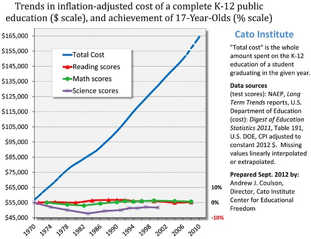

# Long-term NAEP Results vs Education Spending
This repo is intended to address common fallacies in comparing the long-term trends in education spending and scores on the National Assessment of Educational Progress (NAEP). In particular, there is a chart from the Cato Institute (below) that has been referenced a few times by school choice advocate Corey DeAngelis on Twitter (see tweets [1](https://twitter.com/DeAngelisCorey/status/1269494299344986118?s=20), [2](https://twitter.com/DeAngelisCorey/status/1269504845066756097?s=20), and [3](https://twitter.com/DeAngelisCorey/status/1269676304535883776?s=20)). The graph originates from this [2011 report](https://edlabor.house.gov/imo/media/doc/documents/112/pdf/statements/CoulsonTestimony021011.pdf), with some other references in [2012](https://www.cato.org/blog/public-school-spending-theres-chart) and [2013](https://www.cato.org/blog/new-naep-scores-extend-dismal-trend-us-education-productivity).

